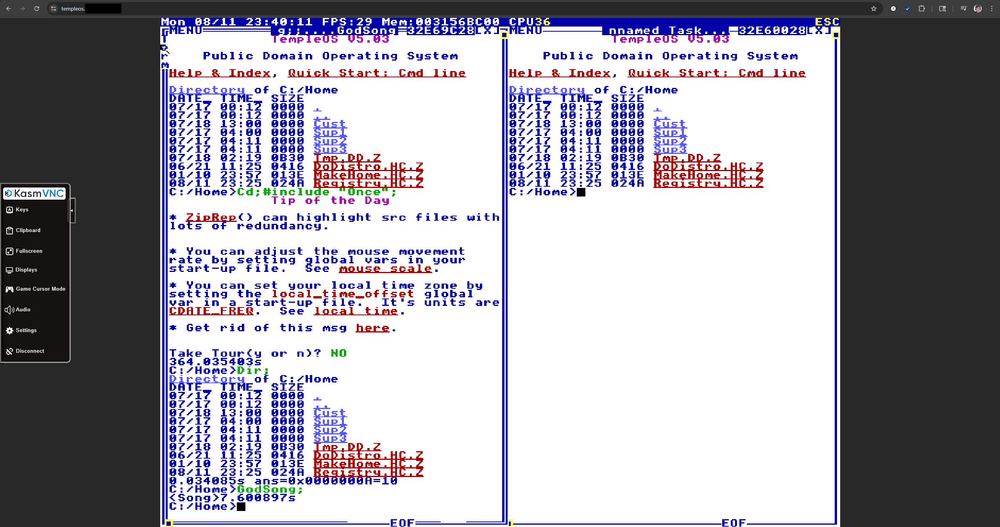

# temple-os-docker

### Running
1. Clone the repository
2. Make sure you have docker (or docker desktop for windows) installed
3. Make sure you have built an image of TempleOS for qemu \
Some videos online show like this: [TempleOS in Qemu](https://www.youtube.com/watch?v=lQHPHiewG2U) (only like the first ~8 min)
4. Edit `docker-compose.yml` and change the left side of the volumes attribute to where you saved the TempleOS image file on your device.
5. Run `docker compose up -d` on your device in the cloned directory
6. Access it on port 21014 (you can change this in `docker-compose.yml`)

### Hotkeys
- Ctrl + Shift + 1
  - Toggle Control Panel
- Ctrl + Shift + 2
  - Toggle Game Pointer Mode
- Ctrl + Shift + 3
  - Toggle Pointer Lock
- Ctrl + Shift + 4
  - Toggle Audio

### Known Issues
- Sometimes, it does not let you attain mouse focus on the templeos screen on VNC online unless you click on the top left corner of the canvas
  - This is probably due to the custom resizing but I am not exactly sure how to fix it
  - For some reason, the keyboard does not focus otherwise
- For some reason when the instance first boots up, it takes like 2-3 minutes to stop being at 99 CPU and be actually usable
  - This may be an issue with my image
- Sometimes, temple os just randomly crashes
  - This may be an issue with my image
- Obviously, temple os heavily relies on the escape key
  - As of right now, I do not know if there is any way to tell the browser to avoid using escape as the key to message it to leave pointer lock
- Sometimes sounds lag or are distorted (not entirely sure what could cause this)
